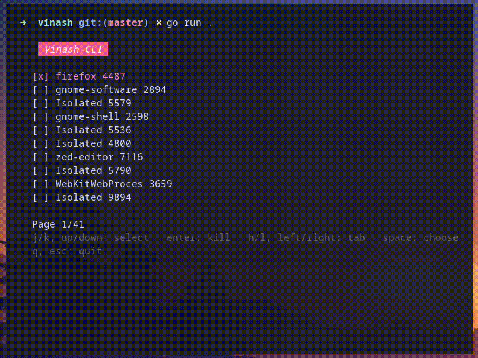

# Vinash CLI

**Vinash CLI** is a terminal-based process management tool built with Go, utilizing the Bubble Tea framework for creating a simple and interactive TUI (Text User Interface). With Vinash CLI, users can monitor and manage system processes, including the ability to select and kill processes in an easy-to-use terminal interface.

## Features

- **Interactive Process Selection**: Navigate through system processes using keyboard shortcuts to select one or multiple processes for management.
- **Process Information**: Displays detailed information about each process, such as PID, memory usage, CPU usage, and command name.
- **Process Killing**: Select multiple processes and terminate them instantly.
- **Tab-Based Navigation**: Switch between different tabs to view a paginated list of processes.
- **Colorful and Styled Interface**: Leverages Lip Gloss for a vibrant and visually appealing interface with borders, gradients, and colors.

## Key Bindings

- `j` or `down`: Move down the list of processes.
- `k` or `up`: Move up the list of processes.
- `l` or `right`: Move to the next tab (group of processes).
- `h` or `left`: Move to the previous tab.
- `space`: Select or deselect a process.
- `enter`: Kill the selected processes.
- `q`: Quit the application.



## Installation

To install Vinash CLI, ensure you have Go installed on your machine and run the following command:

```bash
go install github.com/username/vinash-cli@latest
```
(WIP)

## Usage

Simply run the `vinash` command in your terminal to start managing processes:

```bash
vinash
```

You'll be greeted with a paginated view of running processes. Use the keyboard shortcuts to navigate, select, and kill processes as needed.

## Dependencies

- **[Bubble Tea](https://github.com/charmbracelet/bubbletea)**: The framework for building the TUI.
- **[Lip Gloss](https://github.com/charmbracelet/lipgloss)**: For adding styles and colors to the interface.

## Contributing

Contributions are welcome! If you'd like to contribute, please fork the repository, make your changes, and submit a pull request.

Feel free to reach out if you have any questions or suggestions. Happy process managing with Vinash CLI!
